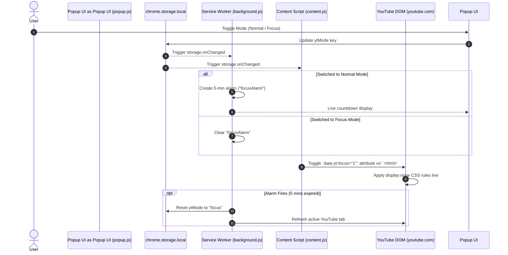

# YTGhoul 🎯

[](https://developer.chrome.com/docs/extensions/mv3/intro/)
[](https://www.gnu.org/licenses/gpl-3.0)
[](https://developer.mozilla.org/)
[](https://developer.chrome.com/docs/extensions/reference/storage/)

> **Distraction-free YouTube extension featuring a Focus Mode feed killer and an automated 5-minute relapse timer.**

---

## 💡 Problem & Solution

### The Problem
Modern video platforms rely on recommendation algorithms designed to maximize session length. YouTube's home feed, recommended watch-page sidebars, and Shorts links divert attention and turn quick research tasks into hours of unintended browsing.

### The Solution
**YTGhoul** gives you instant control over your YouTube experience:
1. **Focus Mode (Default)**: Immediately suppresses recommendation feeds, Shorts navigation links, and related video sidebars using high-performance CSS injection.
2. **Auto-Relapse Protection**: Temporarily switching to Normal Mode starts an automated 5-minute timer. When the timer expires, YTGhoul automatically snaps YouTube back into Focus Mode to protect your attention span.

---

## 🏗 Architecture & System Design

YTGhoul follows an event-driven Manifest V3 architecture with decoupled contexts synchronized through `chrome.storage.local`.



---

## ✨ Feature Matrix

| Feature | Description | Benefit |
|---|---|---|
| ⚡ **Instant CSS Injection** | Applies hidden styles via attribute markers on `<html>` | Zero layout shift or page reloads when toggling modes |
| ⏱ **5-Min Relapse Timer** | Background alarm auto-resets mode to Focus after 5 minutes | Prevents temporary sessions from becoming endless binges |
| ⏳ **Live Countdown** | Real-time timer display inside toolbar popup | Clear visual feedback on remaining normal browsing time |
| 🛡 **Minimal Privileges** | Uses only `storage`, `alarms`, and `host_permissions: youtube.com` | No invasive `tabs` permission or sensitive scope access |
| 🔒 **100% Privacy-Preserving** | Zero analytics, zero remote endpoints, zero data collection | All preferences remain local on your browser device |

---

## 📁 Repository Structure

```
.
├── _archive_clutter/   # Non-production legacy assets (ignored by Git)
│   ├── 1icon.png
│   ├── breakfast.png
│   └── README.md
├── background.js       # Manifest V3 service worker (alarms & tab sync)
├── content.js          # Content script injecting focus CSS on youtube.com
├── icon.png            # Extension toolbar icon (16/48/128px)
├── manifest.json       # Extension Manifest V3 configuration
├── popup.css           # Modern dark-mode popup stylesheet
├── popup.html          # Extension action popup interface
├── popup.js            # Popup UI logic & countdown timer listener
├── .gitignore          # Production Git ignore rules
├── LICENSE             # GNU General Public License v3.0
└── README.md           # Master repository documentation
```

---

## 🚀 Quickstart & Installation

### Prerequisites
- Any modern Chromium-based web browser (**Google Chrome**, **Brave**, **Microsoft Edge**, **Opera**, or **Vivaldi**).

### Installation (Unpacked Extension)

1. **Clone or Download Repository**:
   ```bash
   git clone https://github.com/your-username/yt-ghoul.git
   ```
2. **Open Extensions Page**:
   - Navigate to `chrome://extensions` in your browser.
3. **Enable Developer Mode**:
   - Toggle the **Developer mode** switch in the top-right corner.
4. **Load Extension**:
   - Click **Load unpacked** (top-left).
   - Select the `YTGhoul` repository root folder.
5. **Pin & Use**:
   - Pin the YTGhoul icon to your browser toolbar and click it to switch modes.

---

## 🧪 Testing & Verification

1. **Verify Focus Mode**:
   - Open [YouTube](https://www.youtube.com).
   - Confirm that the home recommendation grid, Shorts sidebar links, and watch-page related video sidebars are hidden.
2. **Verify Auto-Relapse Timer**:
   - Open the extension popup and select **Normal Mode**.
   - Confirm the live countdown timer appears in the popup.
   - Wait 5 minutes or inspect `chrome.alarms` to verify automatic reversion to **Focus Mode**.
3. **Verify DOM Performance**:
   - Navigate across YouTube pages (`yt-navigate-finish`).
   - Confirm CSS styles remain attached without refreshing or re-injecting scripts.

---

## 🔐 Security & Secret Hygiene

- **Hardcoded Secrets**: None.
- **External Dependencies**: Zero third-party JavaScript libraries or CDN calls.
- **Data Collection**: 0% (no telemetry, no tracking scripts, no network requests).
- **Permissions Audit**: Uses minimal scope (`storage`, `alarms`, `youtube.com` host permission).

---

## 📦 Recommended Repository Names & Git Guide

### Suggested Repo Names
- `yt-ghoul` (Current brand name)
- `focustube-extension` (Descriptive & searchable)
- `youtube-focus-shield` (Utility-focused)
- `zentube-focus` (Minimalist brand)

### Git Quickstart Command Reference

```bash
# 1. Initialize Git repository
git init

# 2. Add files and check status
git add .
git status

# 3. Create initial production commit
git commit -m "feat: production release of YTGhoul Chrome extension (MV3)"

# 4. Rename main branch & set remote
git branch -M main
git remote add origin https://github.com/your-username/yt-ghoul.git

# 5. Push to remote repository
git push -u origin main
```

---

## 📄 License

Distributed under the **GNU General Public License v3.0**. See [`LICENSE`](LICENSE) for complete licensing terms.
